  

 

> I work across the stack, React and TypeScript on the front, NestJS and PostgreSQL underneath. I'm less interested in which framework is trending than in whether the thing actually works well for the person using it. Most days: building, breaking, rebuilding.

  

 

<table align="center">
  <tr><td width="120"><b>Frontend</b></td><td>React · TypeScript · JavaScript · HTML · CSS · Bootstrap · Redux · RTK Query · React Router · Vite</td></tr>
  <tr><td><b>Backend</b></td><td>NestJS · Node.js · REST APIs · JWT Authentication</td></tr>
  <tr><td><b>Database</b></td><td>PostgreSQL · TypeORM</td></tr>
  <tr><td><b>Tools</b></td><td>Git · GitHub · Postman</td></tr>
</table>

  

 

→ Building full-stack applications with React, NestJS, and PostgreSQL 
→ Getting more deliberate about backend architecture 
→ Paying closer attention to UI/UX, not just UI 
→ Learning by shipping, mostly in public

  

 

  
  

  

  

 

> Good developer experience. Interfaces that get out of the way. The distance between a feature that works and one that's actually well made.

  

 

<a href="https://github.com/Alishba-Alvi"><b>GitHub</b></a> &nbsp;·&nbsp;
<a href="https://www.linkedin.com/in/alishba-riasat/"><b>LinkedIn</b></a>

  

   &nbsp;<i>Somewhere between the frontend and the backend, that's where you'll find me.</i>

